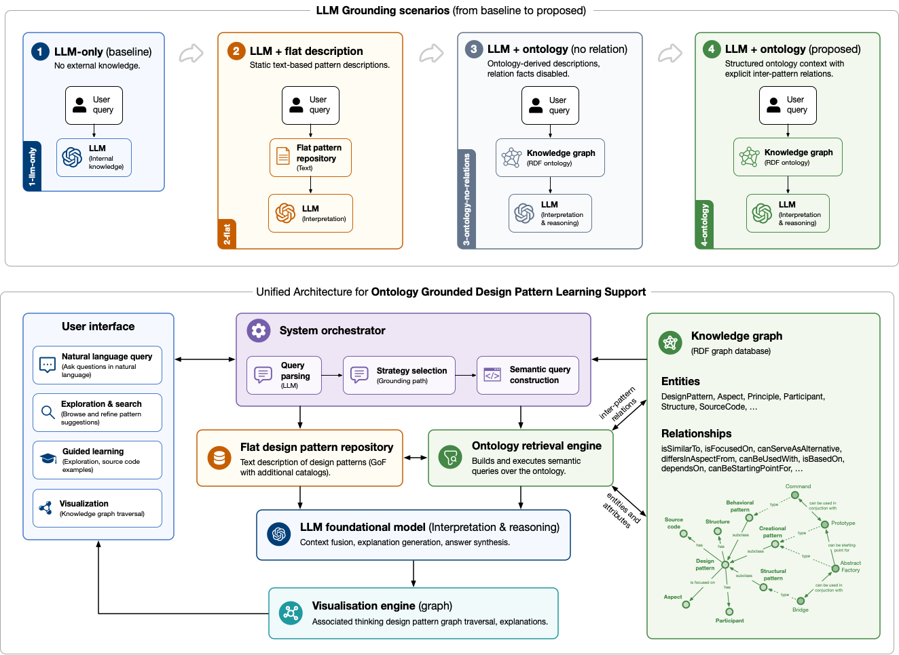
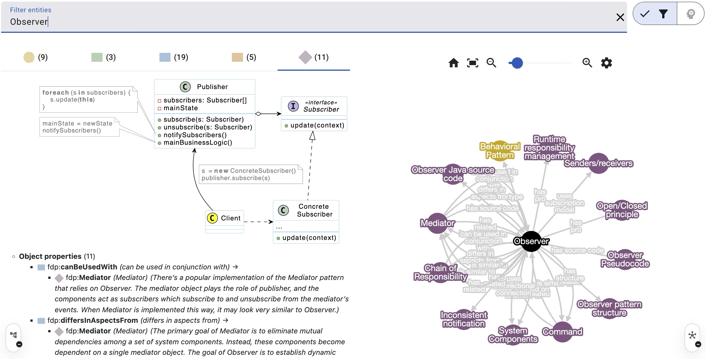

# Formal Design Patterns (FDP)

> **Dejan Lavbič** and **Marko Poženel**

Formal Design Patterns (FDP) is a relation-aware OWL knowledge graph for Gang of Four design patterns. It models patterns, participants, structures, tradeoffs, and typed relationships so that developers, students, and educators can explore, compare, select, and explain design patterns with ontology-grounded LLM support.

**Links**

- [FDP Atlas: interactive ontology visualizer](https://dejanl.github.io/FDP/)
- [Current ontology TTL](https://dejanl.github.io/FDP/FDP.ttl)

## Research Context

This repository accompanies the research article **“A Relation-Aware Knowledge Graph for Software Design Pattern Selection and Explanation”** by **Dejan Lavbič** and **Marko Poženel**.

The work contributes:

- the FDP ontology, a relation-aware OWL model of GoF design patterns;
- FDP Atlas, an interactive visualization and querying tool;
- a controlled four-mode benchmark that isolates the effect of explicit ontology relations on LLM-supported pattern recommendation and explanation.

## What The Ontology Contains

FDP models all **22 GoF design patterns** as ontology individuals and connects them through explicit, typed semantic relations. Its current published version contains:

- **80 classes**, **51 object properties**, **6 data properties**, and **13 annotation properties**;
- **255 individuals** and **2,687 axioms**;
- **529 object property assertions** that encode pattern and structural relations.

The relation model covers six categories: alternatives, composition, evolutionary transitions, structural similarity, structural characteristics, and pattern aspects such as pros, cons, and design focus.

*Unified architecture and evaluated grounding scenarios for ontology-grounded design pattern learning support.*

## FDP Atlas

[FDP Atlas](https://dejanl.github.io/FDP/) is an Angular web application for exploring the ontology as an interactive graph of classes, properties, individuals, and pattern relations. It can run as a static GitHub Pages deployment by loading `docs/FDP.ttl`, while local deployments can also connect to a GraphDB repository.

When the optional backend API is available, FDP Atlas supports LLM-assisted natural-language querying. The LLM is not used as an open-ended chat source; instead, it receives ontology-derived candidate patterns, labels, intents, and relation facts, and returns a schema-constrained recommendation with confidence, explanation, and alternatives.

*FDP Atlas displaying the neighborhood of the `Observer` pattern, including related patterns, structural aspects, and participants.*

## Evaluation

### Summary

The benchmark evaluates whether explicit relationships between GoF design patterns improve LLM-supported pattern selection and reasoning. It contains **45 tasks** across three task types (`distinguish`, `alternative`, and `combine`), including 30 realistic `design-choice` tasks and 15 `relation-critical` tasks. Using `gpt-4.1-mini`, each task was evaluated three times at temperature `0` across four context modes: `1-llm-only`, `2-flat`, `3-ontology-no-relations`, and `4-ontology`.

- The full relation-aware ontology mode achieved the strongest results: **94.81% selection accuracy**, **84.44% relation-critical accuracy**, and **78.52% distractor rejection**.
- Without explicit relations, relation-critical accuracy reached **37.78%** for `1-llm-only`, **57.78%** for `2-flat`, and **48.89%** for `3-ontology-no-relations`.
- The strongest gains appeared on relation-intensive tasks, especially `combine` tasks, where explicit relations such as `canBeUsedWith` and `canBenefitFrom` directly support pattern composition reasoning.

Benchmark task set

| ID         | Task type, difficulty and eval group   | Decisive constraint                                                                                     | Base and candidate patterns                                             | Acceptable patterns | Expected relations                                               |
| ---------- | -------------------------------------- | ------------------------------------------------------------------------------------------------------- | ----------------------------------------------------------------------- | ------------------- | ---------------------------------------------------------------- |
| d&#8209;01 | distinguish, easy, design-choice       | Retrofit interface compatibility is the problem, not a preplanned separation of hierarchies.            | — / Adapter, Bridge, Facade, Proxy                                      | Adapter             | solvesIncompatibility, differsInAspectsFrom                      |
| d&#8209;02 | distinguish, easy, design-choice       | The problem is not creating a family of compatible products.                                            | — / Abstract Factory, Builder, Factory Method, Prototype                | Builder             | isFocusedOn, differsInAspectsFrom                                |
| d&#8209;03 | distinguish, easy, design-choice       | Algorithms change, but they do not model allowed state transitions.                                     | — / State, Command, Strategy, Template Method                           | Strategy            | enablesSwappingAlgorithms, differsInAspectsFrom                  |
| d&#8209;04 | distinguish, medium, design-choice     | The lifecycle and state transitions are decisive, not algorithm selection.                              | — / Strategy, Command, Template Method, State                           | State               | isExtensionOf, differsInAspectsFrom                              |
| d&#8209;05 | distinguish, medium, design-choice     | The problem is neither preserving a service interface nor adapting one incompatible interface.          | — / Facade, Proxy, Adapter, Bridge                                      | Facade              | definesSimplifiedInterface, differsInAspectsFrom, isSimilarTo    |
| d&#8209;06 | distinguish, medium, design-choice     | The layer represents a service through the same interface rather than simplifying a subsystem.          | — / Facade, Proxy, Adapter, Bridge                                      | Proxy               | keepsOriginalInterface, isSimilarTo, differsInAspectsFrom        |
| d&#8209;07 | distinguish, medium, relation-critical | The problem is not retrofitting an incompatible interface.                                              | — / Adapter, Abstract Factory, Bridge, Facade                           | Bridge              | differsInAspectsFrom, canBeUsedWith                              |
| d&#8209;08 | distinguish, medium, design-choice     | A product family is essential, not the step-by-step construction of one object.                         | — / Builder, Factory Method, Prototype, Abstract Factory                | Abstract Factory    | isFocusedOn, differsInAspectsFrom                                |
| d&#8209;09 | distinguish, medium, relation-critical | The request must be encapsulated, not merely the algorithm swapped.                                     | — / Command, Strategy, State, Visitor                                   | Command             | encapsulatesOperation, differsInAspectsFrom, canBeCombinedWith   |
| d&#8209;10 | distinguish, medium, design-choice     | Variability lies in subclass steps, not in strategy composition.                                        | — / Strategy, Template Method, Factory Method, Command                  | Template Method     | differsInAspectsFrom                                             |
| d&#8209;11 | distinguish, hard, design-choice       | A part-whole hierarchy is essential, not a proxy or interface adaptation.                               | — / Proxy, Adapter, Composite, Visitor                                  | Composite           | differsInAspectsFrom, canBeUsedInConjunctionWith                 |
| d&#8209;12 | distinguish, hard, relation-critical   | Traversal is not the main problem; adding new operations is.                                            | — / Iterator, Composite, Command, Visitor                               | Visitor             | canBeUsedWith, canBeUsedInConjunctionWith, isSimilarTo           |
| d&#8209;13 | distinguish, hard, design-choice       | Traversal and operations are secondary; the main model is a part-whole hierarchy.                       | — / Composite, Iterator, Visitor, Command                               | Composite           | differsInAspectsFrom, canBeUsedInConjunctionWith                 |
| d&#8209;14 | distinguish, hard, relation-critical   | Copying is unsafe because of external resources.                                                        | — / Prototype, Memento, Command, Iterator                               | Memento             | hasSimplerAlternative, canBeUsedInConjunctionWith                |
| d&#8209;15 | distinguish, hard, relation-critical   | Variability is injected as an object rather than through inheritance.                                   | — / Template Method, Command, Strategy, State                           | Strategy            | differsInAspectsFrom, enablesSwappingAlgorithms                  |
| a&#8209;01 | alternative, easy, relation-critical   | Families of products are required, not a single object or cloning.                                      | Factory Method / Builder, Abstract Factory, Prototype, Strategy         | Abstract Factory    | canBeDevelopedFrom, canBeStartingPointFor, isFocusedOn           |
| a&#8209;02 | alternative, easy, design-choice       | Copying is safe, so the full Memento mechanism is unnecessary.                                          | Memento / Command, Iterator, Prototype, Factory Method                  | Prototype           | canBeSimplerAlternativeTo, hasSimplerAlternative                 |
| a&#8209;03 | alternative, easy, design-choice       | The problem is creating concrete strategies, not a state lifecycle.                                     | Strategy / State, Command, Template Method, Factory Method              | Factory Method      | canServeAsAlternative                                            |
| a&#8209;04 | alternative, medium, relation-critical | Copying configured objects is more suitable than adding a new factory hierarchy.                        | Factory Method / Prototype, Abstract Factory, Builder, Template Method  | Prototype           | canBeDevelopedFrom, canBeStartingPointFor                        |
| a&#8209;05 | alternative, medium, design-choice     | The problem is constructing one complex object.                                                         | Factory Method / Abstract Factory, Builder, Prototype, Command          | Builder             | canBeStartingPointFor, isFocusedOn                               |
| a&#8209;06 | alternative, medium, relation-critical | The main problem is creating compatible objects, not providing a simplified API.                        | Facade / Proxy, Adapter, Abstract Factory, Bridge                       | Abstract Factory    | canServeAsAlternative, isFocusedOn, definesSimplifiedInterface   |
| a&#8209;07 | alternative, medium, design-choice     | The problem is reliably creating new types, not saving state.                                           | Prototype / Memento, Builder, Command, Factory Method                   | Factory Method      | canServeAsAlternative, canBeDevelopedFrom, canBeStartingPointFor |
| a&#8209;08 | alternative, medium, relation-critical | The problem is no longer retrofitting an interface.                                                     | Adapter / Bridge, Facade, Proxy, Adapter                                | Bridge              | differsInAspectsFrom                                             |
| a&#8209;09 | alternative, medium, design-choice     | An operation over elements is required, not traversal alone.                                            | Iterator / Composite, Visitor, Command, Memento                         | Visitor             | canBeUsedWith                                                    |
| a&#8209;10 | alternative, medium, design-choice     | A command alone is insufficient because the receiver's state must be restored.                          | Command / Prototype, State, Memento, Iterator                           | Memento             | canBeCombinedWith, canBeUsedInConjunctionWith                    |
| a&#8209;11 | alternative, medium, design-choice     | Traversal is the main goal, not adding new operations.                                                  | Composite / Visitor, Builder, Prototype, Iterator                       | Iterator            | canBeUsedInConjunctionWith                                       |
| a&#8209;12 | alternative, hard, relation-critical   | The new requirement is an algorithm skeleton, not freely interchangeable strategies.                    | Strategy / Template Method, Command, State, Factory Method              | Template Method     | differsInAspectsFrom                                             |
| a&#8209;13 | alternative, hard, design-choice       | A simplified subsystem API is not required.                                                             | Facade / Adapter, Proxy, Bridge, State                                  | Proxy               | keepsOriginalInterface, isSimilarTo                              |
| a&#8209;14 | alternative, hard, design-choice       | Traversal alone does not solve adding business operations.                                              | Composite / Iterator, Builder, Visitor, Prototype                       | Visitor             | canBeUsedInConjunctionWith                                       |
| a&#8209;15 | alternative, hard, design-choice       | The new problem is constructing a product step by step.                                                 | Abstract Factory / Factory Method, Prototype, Facade, Builder           | Builder             | isFocusedOn, differsInAspectsFrom                                |
| c&#8209;01 | combine, easy, relation-critical       | Compatible implementations must be selected, not interfaces adapted.                                    | Bridge / Adapter, Facade, Abstract Factory, Proxy                       | Abstract Factory    | canBeUsedWith, isFocusedOn                                       |
| c&#8209;02 | combine, easy, design-choice           | The command stores the request, while the companion pattern stores state for restoration.               | Command / Prototype, State, Iterator, Memento                           | Memento             | canBeCombinedWith, canBeUsedInConjunctionWith                    |
| c&#8209;03 | combine, easy, design-choice           | Traversal is the goal, not adding new operations.                                                       | Composite / Iterator, Visitor, Builder, Memento                         | Iterator            | canBeUsedInConjunctionWith                                       |
| c&#8209;04 | combine, medium, design-choice         | The problem is creating the tree, not traversing it or operating on it.                                 | Composite / Iterator, Builder, Visitor, Prototype                       | Builder             | canBeUsedWith                                                    |
| c&#8209;05 | combine, medium, relation-critical     | The iterator defines how to traverse, while the companion pattern defines what to do with elements.     | Iterator / Composite, Command, Visitor, Memento                         | Visitor             | canBeUsedWith                                                    |
| c&#8209;06 | combine, medium, design-choice         | The task is not only selecting a compatible family, but also building the implementation side.          | Bridge / Abstract Factory, Adapter, Facade, Builder                     | Builder             | canBeUsedWith, isFocusedOn                                       |
| c&#8209;07 | combine, medium, relation-critical     | After creation, the problem is traversing collections.                                                  | Factory Method / Iterator, Prototype, Abstract Factory, Template Method | Iterator            | canBeUsedWith                                                    |
| c&#8209;08 | combine, medium, design-choice         | Cloning helps create the command, but the operation still needs encapsulation.                          | Prototype / Memento, Command, Factory Method, Strategy                  | Command             | canBeUsedWith, encapsulatesOperation                             |
| c&#8209;09 | combine, medium, design-choice         | Traversal alone is insufficient; an extensible operation is required.                                   | Composite / Iterator, Builder, Visitor, Command                         | Visitor             | canBeUsedInConjunctionWith                                       |
| c&#8209;10 | combine, medium, design-choice         | The saved state belongs to traversal over a collection.                                                 | Memento / Command, Prototype, State, Iterator                           | Iterator            | canBeUsedInConjunctionWith                                       |
| c&#8209;11 | combine, hard, relation-critical       | The factory selects a family, while Bridge separates the development of abstraction and implementation. | Abstract Factory / Bridge, Builder, Adapter, Facade                     | Bridge              | canBeUsedWith, differsInAspectsFrom                              |
| c&#8209;12 | combine, hard, design-choice           | The command must be constructed, not merely saved or cloned.                                            | Command / Prototype, Builder, Memento, Strategy                         | Builder             | isFocusedOn, encapsulatesOperation                               |
| c&#8209;13 | combine, hard, design-choice           | The problem is creating compatible objects within the subsystem.                                        | Facade / Adapter, Proxy, Abstract Factory, Bridge                       | Abstract Factory    | canServeAsAlternative, isFocusedOn, definesSimplifiedInterface   |
| c&#8209;14 | combine, hard, relation-critical       | The problem is creating concrete strategies, not modeling state or commands.                            | Strategy / State, Command, Template Method, Factory Method              | Factory Method      | canServeAsAlternative                                            |
| c&#8209;15 | combine, hard, design-choice           | The solution starts from an existing tree rather than building it from scratch or merely traversing it. | Composite / Prototype, Builder, Iterator, Visitor                       | Prototype           | canBeUsedWith                                                    |

## Citation

If you use FDP in research, please cite:

> Dejan Lavbič and Marko Poženel. *A Relation-Aware Knowledge Graph for Software Design Pattern Selection and Explanation*. Citation details will be updated after publication.
